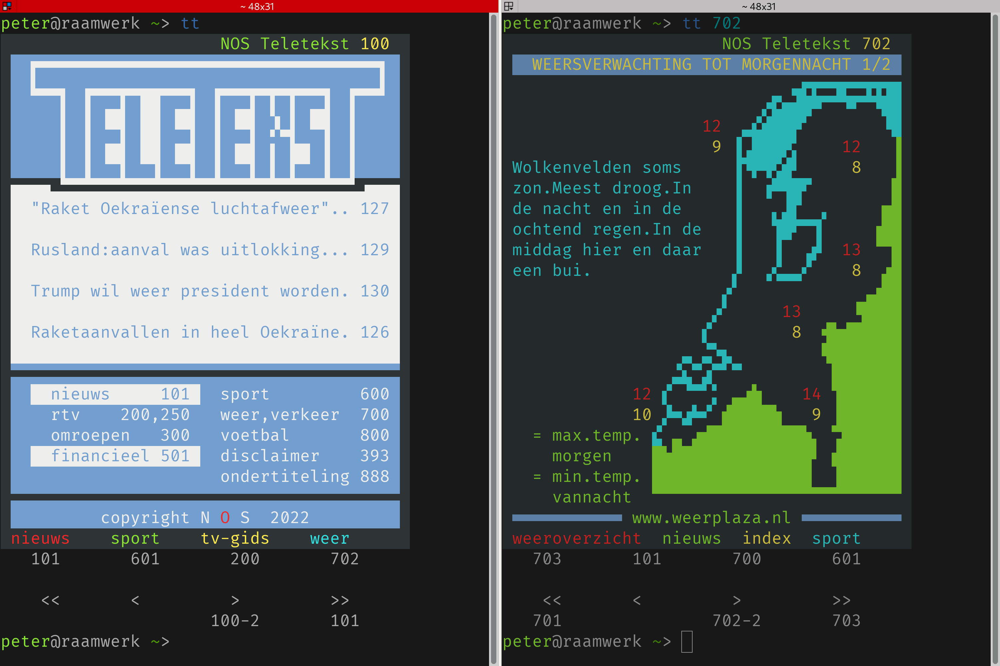
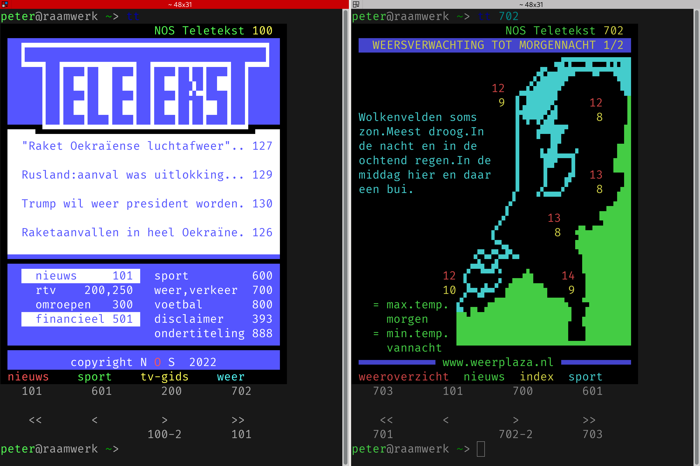

# Teletekst

Yet another teletekst "browser". But this one renders the text in your terminal. And all the graphics. And it's mostly just a single shell oneliner with too much sed.

How? 🪄Magic!🦄 Or really, just unicode. Not just plain old unicode, but fancy new unicode. Yeah, make sure your terminal's font renderer supports Unicode 13 (released in 2020), and specifically [Symbols for Legacy Computing](https://en.wikipedia.org/wiki/Symbols_for_Legacy_Computing). In my case it just worked in all VTE based terminals, but I had to install `unifont-fonts` to get the linked page to render in my browsers (yes, both of them).

You shouldn't have to use any specific font, because the font rendering engine should automatically find missing characters in a fallback font.

Don't expect this to work in plain old `xterm`. I *would* expect this to work on a modern linux vty, but it does not fare much better than `xterm`. YMMV.

## Requirements

- cURL
  - I have no clue what version supports `-sS` because the manpage is silent on this.
- jq (any version I guess)
- html2text 2015.6.21
- bash, sed, tr (probably any version of those)

## Known working terminals
- VTE based terminals:
  - Gnome terminal (the new one)
  - Gnome terminal (the old one)
  - Terminator
  - the terminal thingy in Geany

## Known broken terminals

Most (all?) of these still render the text and colors fine. Some of the graphic characters (the full solid block for example) would also be fine on most terminals.

- xterm
- Linux VTY (I tried 6.1.0-rc4 even!)

## Screenshots
(these are in two different color schemes of my terminal emulator)

